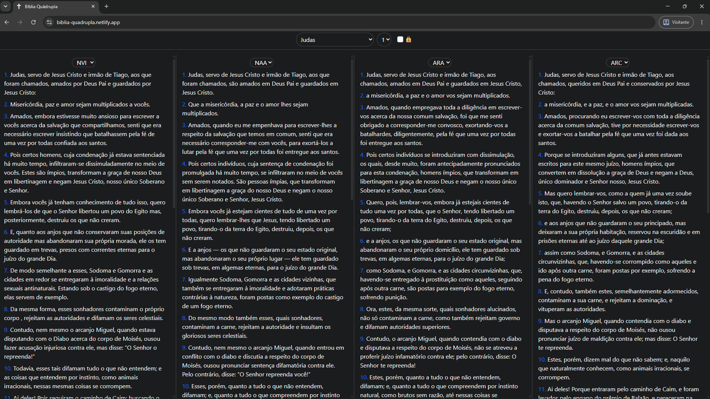

Esse é um aplicativo feito para melhorar a qualidade do estudo bíblico. Ele mostra simultaneamente, lado a lado, 4 versões diferentes da bíblia para comparação.

Versões atualmente disponíveis:
* **ARA**;
* **ARC**;
* **NVI**;
* **NAA**;

(As traduções foram retiradas [deste](https://github.com/damarals/biblias) repositório).

Acesse [aqui](https://biblia-quadrupla.netlify.app/) a versão web.

Para rodar localmente (necessária a instalação do Node e NPM):
* Clone o projeto;
* Rode `npm install` na pasta;
* Rode `npm run dev`;
* Acesse `localhost:5173`;

## ⚠️ Aviso Legal

Este é um projeto de código aberto desenvolvido exclusivamente para fins de **estudo pessoal e acadêmico**, sem qualquer tipo de comercialização, exibição de anúncios ou fins lucrativos. 

Os direitos autorais de todas as edições e traduções bíblicas pertencem às suas respectivas editoras.